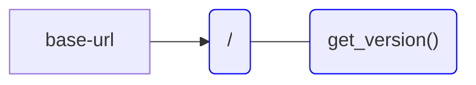
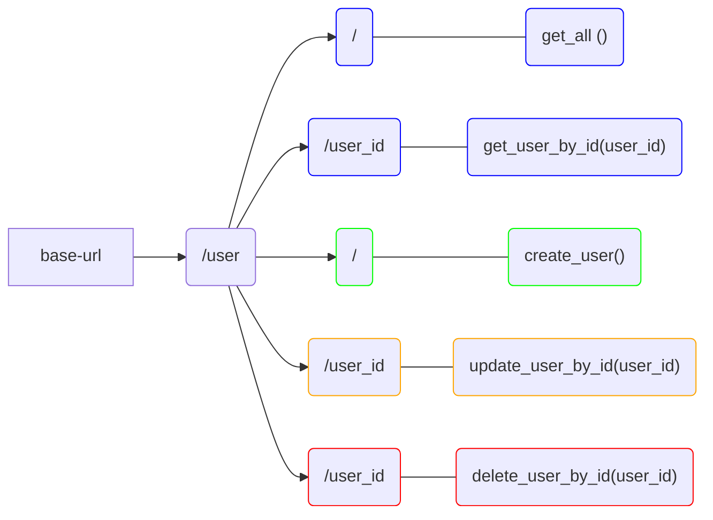
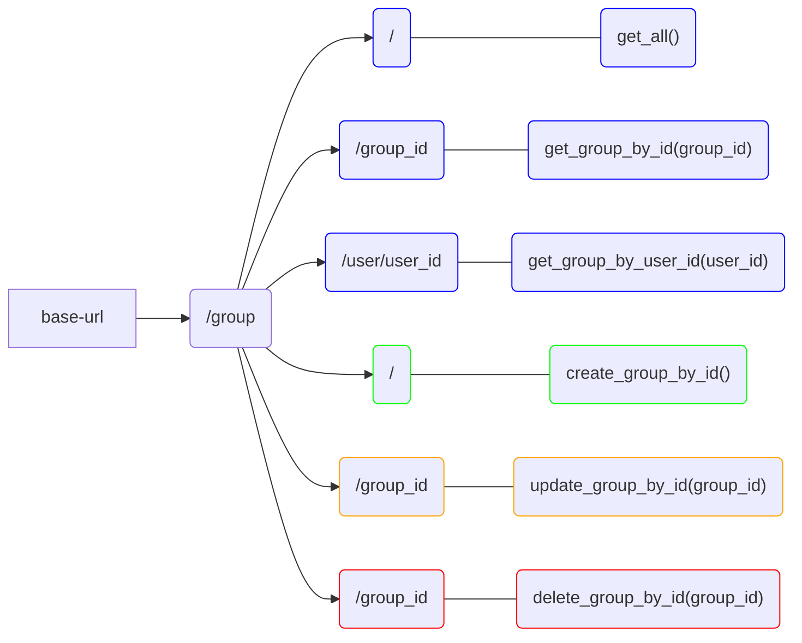
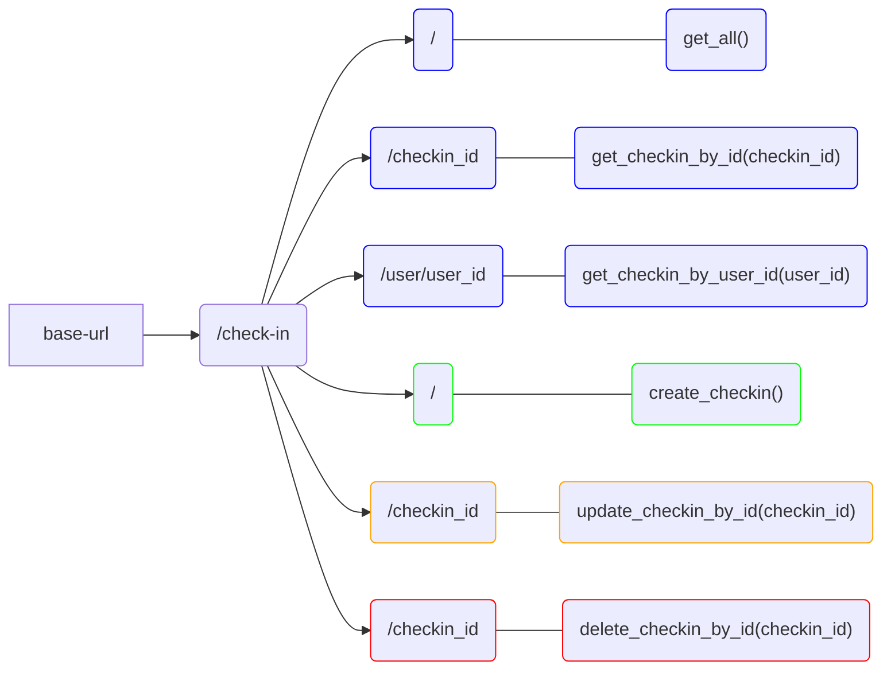
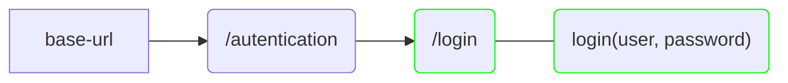
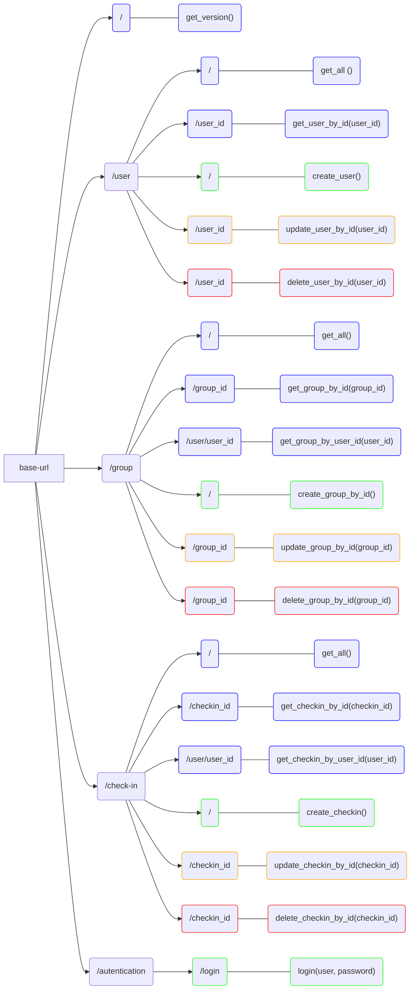
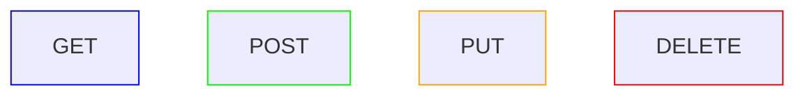

# Documentação de Rotas

### Raiz

#### Diagrama

#### Rotas

#### GET:base-url/
> Retorna:  Número da versão atual do back-end.

### Usuário

#### Diagrama

#### Rotas

#### GET:base-url/user
Solicita a listagem com todos os usuários cadastrados.
> Retorna: Array de entidades Usuário.

#### GET:base-url/user/user_id
Solicita os dados de um usuário de acordo com o id.
> Recebe: Parâmetro user_id.
> Retorna: Entidade Usuário.

#### POST:base-url/user
Salva os dados cadastrais de um usuário.
> Recebe: Body com os dados cadastrais do usuário.
> Retorna: Entidade Usuário.

#### PUT:base-url/user/user_id
Atualiza os dados cadastrais de um usuário de acordo com o id.
> Recebe: Body com os dados de atualização do usuário.
> Retorna: Entidade Usuário atualizada.

#### DELETE:base-url/user/user_id
Apaga os dados de um usuário de acordo com o id.
> Recebe: Parâmetro user_id.
> Retorna: Boleano.

### Grupo

#### Diagrama

#### Rotas

#### GET:base-url/group
Solicita a listagem com todos os grupos cadastrados.
> Retorna: Array de entidades Grupo.

#### GET:base-url/group/group_id
Solicita os dados de um Grupo de acordo com o id.
> Recebe: Parâmetro group_id.
> Retorna: Entidade Grupo.

#### GET:base-url/group/user/user_id
Solicita a lista de grupos dos quais o usuário faz parte.
> Recebe: Parâmetro user_id.
> Retorna: Array de entidades Grupo.

#### POST:base-url/group
Salva os dados cadastrais de um grupo de acordo com o id.
> Recebe: Body com os dados cadastrais do grupo.
> Retorna: Entidade Grupo.

#### PUT:base-url/group/group_id
Atualiza os dados cadastrais de um grupo de acordo com o id.
> Recebe: Body com os dados de atualização do grupo.
> Retorna: Entidade Time atualizada.

#### DELETE:base-url/group/group_id
Apaga os dados de um grupo de acordo com o id.
> Recebe: Parâmetro group_id.
> Retorna: Boleano.

### Check-in

#### Diagrama

#### Rotas

#### GET:base-url/check-in
Solicita a listagem com todos os check-ins cadastrados.
> Retorna: Array de entidades Checkin.

#### GET:base-url/check-in/checkin_id
Solicita os dados de um check-in de acordo com o id.
> Recebe: Parâmetro checkin_id.
> Retorna: Entidade Checkin.

#### GET:base-url/check-in/user/user_id
Solicita a lista de check-ins registrados pelo usuário.
> Recebe: Parâmetro user_id.
> Retorna: Array de entidades Checkin.

#### POST:base-url/check-in
Salva os dados cadastrais de um check-in.
> Recebe: Body com os dados cadastrais do check-in.
> Retorna: Entidade Checkin.

#### PUT:base-url/check-in/checkin_id
Atualiza os dados cadastrais de um check-in.
> Recebe: Body com os dados de atualização do check-in.
> Retorna: Entidade Checkin atualizada.

#### DELETE:base-url/check-in/checkin_id
Apaga os dados de um check-in de acordo com o id.
> Recebe: Parâmetro checkin_id.
> Retorna: Boleano.

### Autenticação

#### Diagrama

#### Rotas

#### POST:base-url/autentication/login
> Recebe: Body com os dados de login (Usuário e senha). 
> Retorna: Token JWT.

## Diagrama geral de rotas

### Legenda

